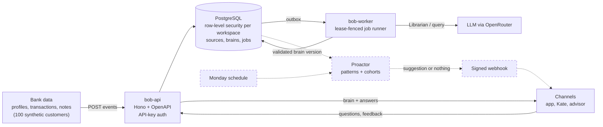

# Krazy Builder Club: BOB

> **Disclaimer:** we could not use Aikido during the hackathon because its access limits were saturated, so the security-scanning part of the task is not done. Nothing in this repository claims Aikido results.

**BOB (Bank-Organized Brain)** rethinks how a bank stores what it knows about its customers. Tectonic Hackathon, KBC challenge: make customers' lives fundamentally simpler.

## The Idea

Banks already hold the data that marks the big moments in a life: salaries, rent, child benefit, savings. It sits in tables built for bookkeeping, not understanding, so customers still get generic offers.

BOB gives every customer a **brain**: readable Markdown that an LLM or agent can interpret, built from that bank data. Every line cites the transaction or statement it came from.

- **Librarian agent:** keeps each brain up to date as new data arrives (transactions, profile data, notes, corrections).
- **Proactor agent:** on a schedule (Monday morning), looks for patterns *within* one brain (savings dropping below the customer's own goal) and *across* brains (similar families who later bought a bigger home). It then proposes one simple, explained next step, or nothing.
- **Channels:** the app, Kate or an advisor all read the same central brain, so every channel knows the same customer.

Example: Emma rents in Leuven, has two kids and just got an 18% raise, and daycare pushed her savings under her own €5,000 buffer. Most similar families moved to a bigger home within six months. BOB does not push a mortgage; it asks "Is your home still big enough?" and shows a budget that protects her buffer.

## What Works Today

| Part | Status |
|---|---|
| API: customers, event intake, brain reads, jobs, OpenAPI | Built, runs locally |
| Librarian: evidence-linked memory, validated patches, corrections | Built, live-tested locally via OpenRouter |
| Ask BOB: plain-English questions answered from one brain | Built |
| 100 synthetic customers and an importer into the API | Built on branch `feat/fixtures-synthetic-bank` |
| Proactor, scheduled delivery, uploads | Next |
| Google Cloud deployment | Designed, not deployed |
| MCP adapter | Proposed |

## Architecture



Dashed parts are designed but not built. API and worker share one codebase; the target is Cloud Run with Cloud SQL, Cloud Tasks and Cloud Scheduler in `europe-west1`. The model writes a structured patch; code validates it against the evidence and renders the Markdown, so the brain cannot contain an uncited fact.

Each brain is five Markdown files, some split into sub-documents, plus an evidence ledger ([ADR 0008](docs/decisions/0008-situation-personality-experience-memory.md)):

```text
overview.md                     generated summary, no facts of its own
situation/current.md            what is true now
situation/goals.md              what the customer wants (stated or confirmed)
personality/preferences.md      how they decide
personality/communication.md    how they like to be helped
experience/history.md           life events and past decisions
experience/interactions.md      contacts, feedback, accepted or rejected help
evidence/sources.md             every source and what it supports
```

<!-- Screenshots (neilord): add images to docs/assets/ and reference them here, e.g.

-->

## Start Here

| Read | Purpose |
|---|---|
| [Docs index](docs/README.md) | Information map and governance |
| [Product reference](docs/product.md) | Requirements, role boundaries, and questions |
| [Current state](docs/STATE.md) | Current phase and next work |
| [Agent entry point](AGENTS.md) | Coding and management agent onboarding |
| [Architecture](docs/architecture.md) | Selected stack, service boundaries and implementation sequence |
| [API contract](docs/api.md) | Planned ingestion, reads, schedules and webhooks |
| [Source register](docs/sources/README.md) | Provenance and precedence |

## Run Locally

Requires Node 24, pnpm 11 and Docker. Copy `.env.example` to `.env` and set its secrets.

```bash
pnpm install
```

```bash
pnpm db:up
```

```bash
pnpm db:migrate
```

```bash
pnpm operator dev:login-roles --api-password <pw> --worker-password <pw>
```

```bash
pnpm operator workspace:create --name "Demo Bank"
```

```bash
pnpm operator key:create --workspace <workspace_id> --name demo --capabilities all --all-customers
```

```bash
pnpm dev:api
```

The API serves `/openapi.json` on port 3000. `pnpm dev:worker` runs the worker with the in-process local driver; point its `DATABASE_URL` at the worker login role. The Librarian needs a model: set `OPENROUTER_API_KEY` in the worker's environment (default model `google/gemini-3.8-flash`, override with `LIBRARIAN_MODEL`/`QUERY_MODEL`). Without a key, Librarian and query jobs stay queued. The full check is `pnpm verify` (see [testing](docs/testing.md)).

### Librarian Quickstart

With `KEY` set to the issued API key: create a customer (this also creates the empty brain), send information, then read the brain or ask a question.

```bash
curl -s localhost:3000/v1/customers -H "Authorization: Bearer $KEY" -H 'content-type: application/json' -d '{"external_id":"demo-001"}'
```

```bash
curl -s localhost:3000/v1/customers/$CUSTOMER/events -H "Authorization: Bearer $KEY" -H "Idempotency-Key: $(uuidgen)" -H 'content-type: text/plain' --data 'I start a new job in Antwerp in November and want to move before December.'
```

```bash
curl -s "localhost:3000/v1/customers/$CUSTOMER/brain?format=markdown" -H "Authorization: Bearer $KEY"
```

```bash
curl -s localhost:3000/v1/customers/$CUSTOMER/query -H "Authorization: Bearer $KEY" -H "Idempotency-Key: $(uuidgen)" -H 'content-type: application/json' -d '{"question":"What is this customer planning?","wait_seconds":20}'
```

Repository: [neilord/krazy-builder-club](https://github.com/neilord/krazy-builder-club).
