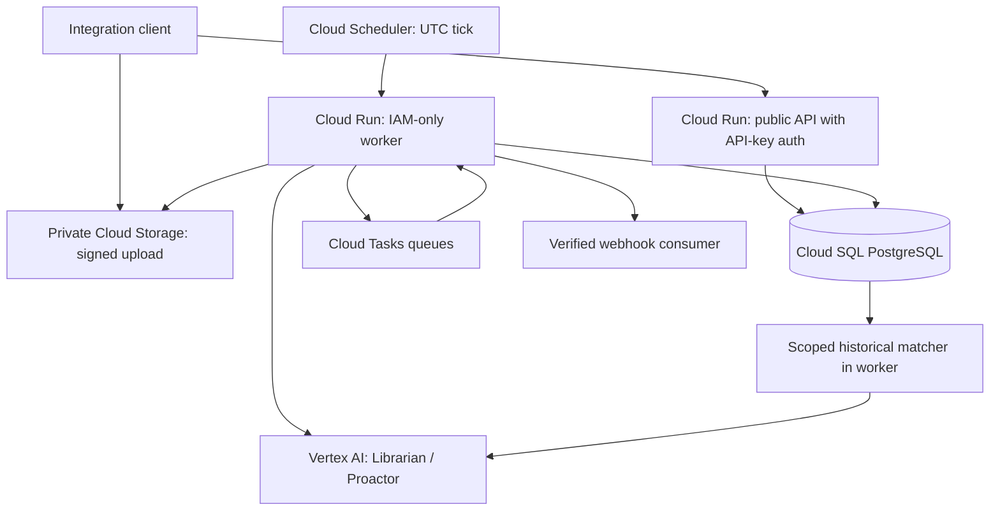

# Backend Architecture

This is the selected design for implementation, not a deployed system. It follows the Google Cloud, database-first, API-only direction in the latest request. [ADRs](decisions/README.md) explain the choices; [data](data.md) defines persistence, [API](api.md) defines contracts, and [conventions](conventions.md) owns deployment mechanics.

## Stack

| Area | Selection |
|---|---|
| Runtime | Node.js 24 LTS, TypeScript with native ESM, pnpm 11 workspace; exact package/image versions pinned during scaffold |
| HTTP | Hono 4, `@hono/node-server`, `@hono/zod-openapi`, Zod 4; generated OpenAPI 3.1 |
| Persistence | Cloud SQL PostgreSQL 17; Drizzle ORM/migrations and `pg` connection pool |
| Files | Private Google Cloud Storage bucket; short-lived signed uploads/downloads |
| Models | Google Gen AI SDK `@google/genai`, Vertex AI API with runtime service-account identity |
| Initial model | `gemini-3.5-flash` for both roles, configurable separately; structured JSON output and runtime validation |
| Background work | Cloud Tasks HTTP queues targeting IAM-protected Cloud Run worker endpoints |
| Clock | Cloud Scheduler every minute in UTC; database owns each subscription's timezone/due time |
| Infrastructure | Terraform, Artifact Registry, Secret Manager, Cloud Logging/Monitoring |
| Verification | Biome, Vitest, real PostgreSQL integration tests, cloud acceptance checks |
| Client surface | API and generated reference docs; no application frontend or signup UI in MVP |

Hono follows SecondSell's explicit dependency injection and route/schema generation. Drizzle/PostgreSQL and Cloud Run also match LeadFilter, the SaaS template, and the Zoho assistant. Reuse their patterns and meaningful tests, not unrelated marketplace/SaaS/billing code. No private `@zsetup/*` package dependency is required for this public hackathon project.

Choose PostgreSQL over Firestore because this workload needs transactional source/brain/job updates, scoped relations, historical joins, and consistent idempotency constraints. JSONB preserves flexible source payloads; relational structure does not require every input to have a fixed domain schema. No separate customer databases, vector database, Redis, Kubernetes, or agent orchestration platform is needed initially.

## Deployment Map



Two Cloud Run services run entrypoints from one codebase/image: `bob-api` and `bob-worker`. A Cloud Run Job runs database migrations. The worker exposes fixed internal handlers for dispatch, extraction, Librarian, query, Proactor, and delivery; it requires Google IAM authentication. Public API keys never authorize internal handlers.

Default resource region is `europe-west1` (Belgium), configurable before provisioning. Place SQL, bucket, queues, registry, and compute together. Synthetic demo inference may use Vertex's global endpoint for model availability; this is not an EU-only data-residency guarantee. Real-data processing needs an explicitly verified permitted model endpoint and retention policy before enablement. Model ID/region access must be live-tested in the target project.

## Repository Shape

Target layout, to create during scaffolding:

```text
apps/backend/
  src/api/                 Hono routes and API-key middleware
  src/worker/              IAM-only task handlers and scheduler dispatcher
  src/modules/
    ingestion/             events, uploads, extraction orchestration
    identity/              workspaces, API keys, customer grants
    librarian/             supported memory patches and grounded answers
    patterns/              deterministic eligible historical matching
    proactor/              need evaluation and insight lifecycle
    delivery/              subscriptions, webhook validation/signing
  src/adapters/             pg, GCS, Cloud Tasks, Vertex, clock
  src/config/               validated environment
  src/migrate.ts            compiled migration entrypoint
packages/contracts/         shared Zod schemas and provider-output schemas
packages/storage/           one Drizzle schema, scoped repositories, migrations
fixtures/synthetic-bank/    reproducible reference/evaluation customers
infra/terraform/            GCP resources and least-privilege identities
scripts/                    provisioning, replay, evaluation, OpenAPI generation
```

API and worker import the same contracts/repositories. Modules are logical ownership boundaries, not independently deployed microservices. Explicit dependencies make cloud adapters replaceable locally. Storage alone owns migrations; contracts has no storage/runtime dependencies. No `apps/web` scaffold is required.

## Ingestion and Librarian

1. Authenticate the integration and resolve workspace/customer permission from the key, not an unchecked request field.
2. Validate an envelope while accepting arbitrary bounded JSON or plain text inside it. Commit original source, customer source revision, job, and enqueue outbox in one transaction; return `202`.
3. Dispatcher turns pending outbox rows into Cloud Tasks. Files first pass upload finalization and extraction; normalized text retains links to original evidence.
4. Librarian loads only the target customer's supported context and source batch. The model returns a schema-validated patch with evidence IDs, statuses, and scope.
5. Outside the model call, deterministic code checks referenced evidence and renders the fixed Markdown documents from structured memory.
6. Atomically commit a new brain version, profile signature, processing watermark, and job result only if the base brain/source revisions still match. On conflict, rerun against current inputs; no long database transaction spans inference.

Input ingestion never automatically queues the default Proactor review. A correction immediately marks dependent insights stale; Librarian applies the supported correction without waiting until Monday.

"Anything" means a common intake envelope and raw retention, with an extensible extractor registry. Initially extract text/Markdown, JSON, CSV, text-based PDF, and supported image content through a bounded adapter. Preserve unknown MIME uploads with `unsupported` extraction status. Encrypted/scan-only PDFs, office documents, audio/video, archives, and arbitrary URL crawling do not silently count as understood. Add extractors independently without changing customer identity or memory contracts.

Initial caps: 1 MiB JSON requests, 100 KiB inline text, 20 MiB finalized uploads, 50 PDF pages, and 200 KiB extracted text per job. Reject or request splitting rather than silently truncating. Upload URL constraints are not the sole size control: finalization reads actual size/type/generation, and extraction rechecks them. PDFs use a maintained text parser selected/tested during scaffold; images use supported model input under the same evidence contract. No shell execution of uploaded content.

## Reading

Direct GETs return permitted sources, brain versions/Markdown, and insights from PostgreSQL. Grounded questions are asynchronous jobs with a captured brain version and evidence references. They use Librarian's read-only configuration; pending newer sources are explicitly reported. A model has no arbitrary SQL, storage browsing, URL fetching, or financial-action tool.

API signup is unnecessary for the first integration/demo. An IAM-restricted operator CLI provisions a workspace and initial keys; clients manage customers/subscriptions through scoped endpoints. Email signup is deferred, superseding the earlier intended MVP scope. API reference docs do not imply a consumer frontend.

## Patterns and Proactor

The third responsibility is a **pattern service implemented as ordinary code**, not a third open-ended LLM. It selects authorized historical reference snapshots inside the same workspace, compares separate personality/situation tags, and aggregates observed later outcomes. It cannot read other workspaces. Reference participation is explicit and defaults off except synthetic seed data; per-customer API clients never receive reference profiles.

Start with the brief's transparent heuristic: `0.4 * personality_jaccard + 0.6 * situation_jaccard`, empty dimensions contribute zero, up to ten matches, minimum score 0.5, at least five distinct customers for a cohort rate. These are versioned demo settings, not validated scientific/privacy thresholds. Match at most one snapshot per reference customer, exclude the target, and reject incomplete/future follow-up windows. See data for source-time and observation-time rules.

Demo need: `move_planning_help`, a 30-day horizon, observed reference outcome `requested_move_planning_help`. Explicit customer intent can support help without cohort evidence. Proactor receives the target brain, deterministic financial features when needed, aggregate cohort evidence, and prior feedback. It returns `cohort_supported`, `hypothesis_only`, `insufficient_cohort_support`, or `no_action`; never invent calibrated confidence percentages.

This realizes cross-customer analysis without giving the model all raw brains. A future bounded pattern-discovery model may propose canonical tags or outcome categories for review; it may not automatically expand data access or redefine accepted contracts.

## Clock and Delivery

Subscriptions belong to a workspace and select all active permitted customers or an explicit customer set. Default weekly time is Monday 09:00 `Europe/Brussels`; timezone is required/configurable, not inferred from the developer's machine. Store `next_run_at` in UTC and compute it with a timezone-aware library. Skip nonexistent wall times to the next valid minute; repeated wall times use the earlier occurrence. Persist one unique occurrence so duplicate ticks cannot double-send.

Each UTC scheduler tick runs dispatch and reconciliation, claims due subscriptions in a short locked transaction, creates a review occurrence/customer jobs/outbox, then advances due time. After downtime, catch up at most one overdue occurrence per subscription within 24 hours; mark older occurrences skipped and advance to the next future slot. Large fanout is paginated and resumable.

Each customer review captures current revisions. If ingestion/extraction is pending, retry within the occurrence deadline; after 24 hours mark that customer failed/stale and do not deliver misleading current insights. Freshness is checked again before persisting and before webhook send. A manual authorized evaluation is a separate diagnostic capability, not the weekly trigger.

Delivery emits a per-customer `insight.created` webhook for actionable insights. No-action reviews are available via the review/jobs API and do not send a webhook. Mixed-customer digests are deferred. Fixed payloads carry opaque IDs, explanation/evidence references and synthetic status; exclude raw transactions and other customers' profiles.

Subscription destinations require HTTPS on public port 443, verified challenge ownership, no credentials/fragments, no redirects. Resolve and validate every A/AAAA address and pin the approved address for that connection while retaining TLS hostname verification; reject private, loopback, link-local, metadata, and reserved networks. Revalidate on every send/retry to resist DNS rebinding. Prefer a configured host allowlist for the demo. Client transports must implement this policy, not just perform an initial URL check.

## Durable Work and Limits

PostgreSQL is the job source of truth. Cloud Tasks transports opaque workspace/job IDs, never large payloads. Transactional outbox closes the gap between source commit and queue creation. Duplicate delivery is normal; job and operation keys enforce idempotency in PostgreSQL, independent of Cloud Tasks task-name retention.

Worker claims a job with a lease/fencing token, makes bounded external calls, and commits only while its lease/token remains valid. Per-customer advisory locks or unique active leases serialize brain updates; revision checks remain mandatory. No global ordering assumption. Retry transient failures with backoff; permanent invalid outputs become terminal failed jobs. Expired leases and missing enqueue attempts are reconciled by the clock. Terminal jobs return success to transport so retries stop; durable retry state is inspectable and replayable by an operator.

Use separate `memory`, `analysis`, and `delivery` queues. Initial shared worker limit: two instances, concurrency one per instance; queue limits are tuned within that total. API: max three instances, concurrency 20. Both have `pg` pools capped at five, five-second connect timeout, idle-pool error listener, and shutdown drain. Include migration/dispatcher overlap and rolling revisions in the database connection budget; initial steady-state ceiling is 25 app connections, not a hard guarantee during rollouts.

Agent task deadline is 240 seconds; Cloud Tasks dispatch deadline and worker request timeout are 300 seconds. Model calls have a 90-second timeout, bounded context/output, at most one repair call per attempt, and at most three durable attempts. Webhook sends time out at ten seconds. Split larger extraction work instead of hiding long work after an HTTP response. Provider usage is recorded per run; workspace budgets can pause new model jobs, without blocking direct data reads.

Initial shared per-workspace admission limits are 60 mutations, 120 direct reads and 20 model-job submissions per minute; all are configurable operator limits. Persist fixed-window counters atomically in SQL across API replicas rather than relying on in-process limits. Each model attempt reserves a configured upper-bound usage budget before inference and settles recorded usage afterward; retries and repairs consume budget too. Unknown provider-cost metadata is marked unknown rather than invented. No unlimited model fallback on quota failure.

## Identity and Operations

API keys are random opaque secrets, shown once and stored as HMAC hashes plus display prefix. Keys bind one workspace, capabilities, and optionally customer grants. Runtime SQL roles cannot bypass row security; workspace context is transaction-local and application repositories additionally enforce customer grants. Operator/migration privileges are isolated. No generic SQL tool is exposed to models.

Runtime service accounts use only required Cloud SQL, bucket, queue, model, and secret permissions. Scheduler/task invokers can invoke only the private worker. Signed upload issuance has narrowly scoped signing permission. Webhook signing secrets are encrypted with Cloud KMS and never listed in GET responses. Logs contain IDs, revisions, durations, token usage, and scrubbed codes, not input bodies or credentials.

Start with a zonal Cloud SQL Enterprise development instance with automated backups/PITR configured and tested, a private bucket, and scale-to-zero Cloud Run services. Set instance/queue limits and billing alerts before deployment. Cloud SQL has an always-on cost floor even if HTTP compute scales down; no price or scalability claim is established. Regional HA and real-data retention/deletion policy are prerequisites for any production assessment, outside this synthetic MVP.

## Implementation Sequence and Ownership

1. **Platform owner:** scaffold tooling, contracts, schema/migrations, workspace/key CLI, scoped API, outbox and worker; prove JSON input -> persistent brain -> GET/query with real PostgreSQL.
2. **Librarian owner:** memory patch validation/rendering, source extraction, correction and conflict cases.
3. **Analysis owner:** fixture reference snapshots, deterministic matcher, scheduled Proactor and evaluation.
4. **Delivery owner:** settings, verified webhook transport, signing/retry tests, demo replay.

These are assignable areas; no team members or agents are automatically assigned. Platform owns contracts and storage owns migrations; dependents coordinate modifications. Default local ports are 3000 API, 3002 worker, 5432 PostgreSQL, configurable for conflicts. Local task/clock drivers execute the same handlers without Google credentials. Selected scripts will be documented only when they exist.

## Verified Design References

Architecture recommendations above are our choices; these primary sources support the underlying platform behavior:

- [Hono Node.js runtime](https://hono.dev/docs/getting-started/nodejs).
- [Cloud SQL supported PostgreSQL versions](https://docs.cloud.google.com/sql/docs/postgres/db-versions) and [Cloud Run connections](https://docs.cloud.google.com/sql/docs/postgres/connect-run).
- [Cloud Tasks to private Cloud Run](https://docs.cloud.google.com/run/docs/triggering/using-tasks) and [HTTP task deadlines](https://docs.cloud.google.com/tasks/docs/reference/rest/v2/projects.locations.queues.tasks).
- [Cloud Scheduler delivery](https://docs.cloud.google.com/scheduler/docs/overview) and [cron/timezone behavior](https://docs.cloud.google.com/scheduler/docs/configuring/cron-job-schedules).
- [Cloud Storage signed URLs](https://docs.cloud.google.com/storage/docs/access-control/signed-urls).
- [Google model lifecycle](https://docs.cloud.google.com/vertex-ai/generative-ai/docs/learn/model-versions) and [structured outputs](https://docs.cloud.google.com/vertex-ai/generative-ai/docs/multimodal/control-generated-output). Model availability and schema support still require a target-project smoke test.
- [PostgreSQL row security](https://www.postgresql.org/docs/17/ddl-rowsecurity.html).
